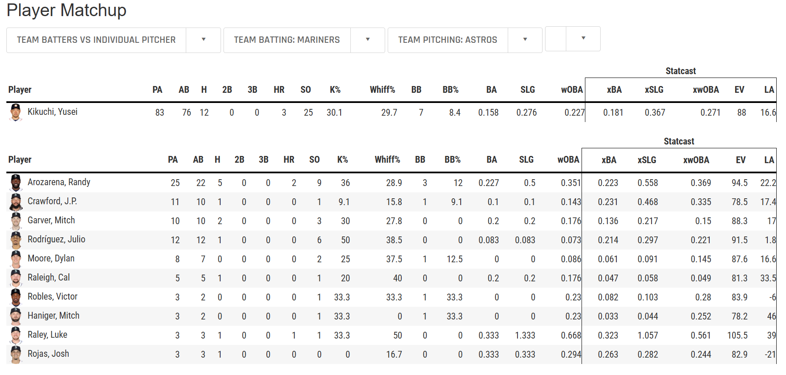

# SwingHedge

C++ Program that predicts batter pitcher matchups in MLB using Statcast data.

## Table of Contents
- [Project Overview](#project-overview)
- [Installation and Usage](#installation-and-usage)
- [Versions](#versions)
- [Contact](#contact)

## Project Overview

Baseball Savant provides a Daily Matchups page, whose data isn't accessible by a standard API.


Each matchup is contained in a tag which includes a matchup link. Each of those links contains the batter matchup data between that batter and the pitcher they are facing that day.



This program sends a request to Baseball Savant, finds the link to each matchup, sends a request to each matchup, gets the Weighted On Base Average (WOBA) of that batter against that pitcher, compiles them all, and then displays the top 10 values.

## Installation and Usage

1. Clone the repository:
   ```bash
   git clone https://github.com/IsaacNorthrop/swinghedge.git

2. Make the program:
    ```bash
    make

3.  Run the program for your specified date that has MLB games between 2015-2024.
    ```bash
    ./bin/swinghegde <YYYY-MM-DD>

## Versions

### Current Version

- **v1.1.0** - November 27th, 2024
    - Performance improvements
      - Multithreading for each matchup
      - HTTP 2.0 for faster requests
      - Program time spent displayed on output
    - Program structure improvments

### Released

- **v1.0.0** - November 19th, 2024
    - Initial Release: Show top 10 WOBA for a given day

### Future Releases

- **v1.2.0** - December 2024
    - Testing framework

## Contact

Isaac Northrop - isaac.northrop88@gmail.com